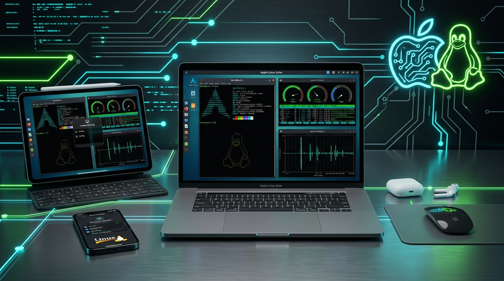

# Apple-Linux-Suite 🍏🐧



[](https://opensource.org/licenses/MIT)
[](https://www.kernel.org/)
[](https://github.com/)

**Apple-Linux-Suite** is a universal toolkit and setup suite designed to solve every major hardware, driver, and ecosystem issue when running **ANY Linux distribution** on **Intel Macs** (MacBook Pro, MacBook Air, iMac, Mac mini, Mac Pro) and connecting **all Apple & mobile devices** (iPhone, iPad, iPod, Android Phones/Tablets, Apple Watch, AirPods, Smart TVs, Magic Accessories).

📖 **[Read the Full Step-by-Step Guide: How to Install Any Linux Distro on a Mac](docs/LINUX_ON_MAC_GUIDE.md)**  
🛡️ **[Read the Legal, Safety & Liability Guide](docs/LEGAL_AND_SAFETY.md)**

---

> [!CAUTION]
> ### ⚠️ DISCLAIMER OF LIABILITY (USE AT YOUR OWN RISK)
> THIS SOFTWARE IS PROVIDED "AS IS", WITHOUT WARRANTY OF ANY KIND, EXPRESS OR IMPLIED. THE REPOSITORY MAINTAINERS, AUTHORS, AND CONTRIBUTORS ARE **NOT RESPONSIBLE OR LIABLE** FOR ANY DIRECT, INDIRECT, INCIDENTAL, SPECIAL, OR CONSEQUENTIAL DAMAGES, INCLUDING BUT NOT LIMITED TO:
> - **BRICKING OR UNBOOTABLE STATES** OF YOUR MAC, PC, PHONE, TABLET, OR HARDWARE.
> - **DATA LOSS OR DATA CORRUPTION** ON ANY CONNECTED STORAGE MEDIA.
> - **HARDWARE OVERHEATING OR PHYSICAL DAMAGE**.
> 
> ALWAYS BACK UP YOUR PERSONAL DATA (VIA TIME MACHINE OR EXTERNAL DRIVE) BEFORE ATTEMPTING DISK PARTITIONING, DRIVER INSTALLATION, OR SYSTEM MODIFICATIONS.

---

## 🛠️ Solved Hardware & Distro Problems

| Hardware Problem | Cause | Apple-Linux-Suite Solution |
|---|---|---|
| 📶 **No Wi-Fi after Linux Install** | Proprietary Broadcom (`bcm43xx`) chips | `broadcom_wifi.sh` auto-detects card and installs `wl` / `b43` drivers across 7+ package managers. |
| 📷 **Webcam Not Detected** | FaceTime HD camera uses PCIe (`bcwc_pcie`), not standard USB UVC | `facetime_hd_camera.sh` automatically extracts macOS firmware and builds kernel module via DKMS. |
| 🔊 **No Sound / Quiet Speakers** | Cirrus Logic CS4208 / CS8409 audio codecs & missing ALSA topology | `cirrus_audio.sh` and `t2_mac_setup.sh` configure ALSA quirks & PipeWire UCM profiles. |
| 💨 **Fans Spinning at 100% / Overheating** | Linux kernel ACPI thermal management doesn't map Mac SMC sensors | `thermal_fans.sh` deploys optimized `mbpfan` daemon configuration. |
| 🖤 **Black Screen on Dual-GPU Macs** | Conflict between Intel IGPU & NVIDIA/AMD Discrete GPU (`apple_gmux`) | `gpu_gmux.sh` fixes brightness controls & powers down discrete GPU on boot. |
| 📱 **iPhone / iPad / Android Transfer** | Missing trust pairing & MTP drivers | Native file manager mounting via `ifuse`, `simple-mtpfs`, and 60fps `scrcpy` screen mirroring. |
| 📺 **AirPlay & Smart TV Cast** | Proprietary casting protocols | `UxPlay` AirPlay mirror receiver daemon + `catt` Smart TV streaming. |
| 💾 **Cannot Read macOS Drives** | APFS & HFS+ file system incompatibility | `ecosystem/apfs_hfs_mount.sh` mounts APFS (apfs-fuse) and HFS+ with write support. |
| 🔀 **Dual-Boot Bootloader Issues** | Mac EFI boot screen showing generic icons | `tools/refind_installer.sh` installs rEFInd graphical bootloader. |
| 🔄 **Offline Driver Recovery** | Kernel updates breaking drivers when offline | `tools/offline_self_heal.sh` background daemon auto-rebuilds modules without internet. |

---

## 🚀 Supported Distributions

Apple-Linux-Suite auto-detects package managers and handles dependencies automatically for:

- **Ubuntu / Debian / Pop!_OS / Linux Mint / Elementary** (`apt`)
- **Arch Linux / Manjaro / EndeavourOS / Garuda** (`pacman`)
- **Fedora / Nobara / RHEL / CentOS** (`dnf`)
- **openSUSE Tumbleweed / Leap** (`zypper`)
- **Void Linux** (`xbps`)
- **Gentoo Linux** (`emerge`)
- **Alpine Linux** (`apk`)

---

## 📦 Quick Start

### 1. Clone the Repository
```bash
git clone https://github.com/shreyastouih-ctrl/apple-linux-Suite.git
cd apple-linux-Suite
chmod +x install.sh apple-linux.sh drivers/*.sh ios/*.sh mobile/*.sh ecosystem/*.sh tools/*.sh
```

### 2. Run the Universal Installer
```bash
sudo ./install.sh
```

### 3. Run Hardware Diagnostic Scanner
```bash
apple-linux
```

---

## 💻 Hardware Compatibility & Architecture Note

- **Intel Macs (2006 – 2020)**: Fully supported by this suite across all Linux distros.
- **Apple Silicon Macs (M1 / M2 / M3 / M4)**: Requires [Asahi Linux](https://asahilinux.org/) due to Apple's custom ARM architecture.

---

## 📄 License

Distributed under the MIT License. See `LICENSE` for details.
