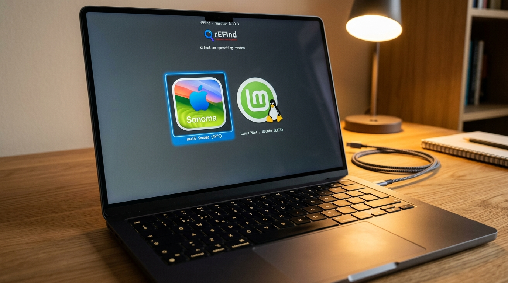

# 🍏 Comprehensive Guide: Installing Any Linux Distribution on a Mac 🐧



This guide walks you through installing **ANY Linux distribution** (Ubuntu, Fedora, Arch Linux, Linux Mint, Pop!_OS, Debian, openSUSE, etc.) on an **Intel Mac** or **Apple Silicon Mac**, setting up a dual-boot system alongside macOS, and using **Apple-Linux-Suite** to fix all hardware drivers.

---

## 📑 Table of Contents
1. [Step 1: Identify Your Mac Model](#step-1-identify-your-mac-model)
2. [Step 2: Back Up Your Mac](#step-2-back-up-your-mac)
3. [Step 3: Create Free Space for Linux (Disk Utility)](#step-3-create-free-space-for-linux-disk-utility)
4. [Step 4: Create a Bootable Linux USB Flash Drive on macOS](#step-4-create-a-bootable-linux-usb-flash-drive-on-macos)
5. [Step 5: Boot Your Mac from the Linux USB Drive](#step-5-boot-your-mac-from-the-linux-usb-drive)
6. [Step 6: Complete the Linux Installation](#step-6-complete-the-linux-installation)
7. [Step 7: Post-Install Setup & Hardware Fixes (Apple-Linux-Suite)](#step-7-post-install-setup--hardware-fixes-apple-linux-suite)
8. [Troubleshooting & FAQs](#troubleshooting--faqs)

---

## Step 1: Identify Your Mac Model

Click the  **Apple Menu** in the top-left corner $\rightarrow$ **About This Mac**:

* **Intel Processor** (e.g. Intel Core i5 / i7 / i9, 2006–2020): Fully supported by standard Linux distros + **Apple-Linux-Suite**.
* **Apple M1 / M2 / M3 / M4 Chip** (2020+): Requires **[Asahi Linux](https://asahilinux.org/)** (custom ARM distribution designed specifically for Apple Silicon).

---

## Step 2: Back Up Your Mac

Before modifying disk partitions:
1. Connect an external hard drive.
2. Open **System Settings** $\rightarrow$ **Time Machine** $\rightarrow$ **Back Up Now**.

---

## Step 3: Create Free Space for Linux (Disk Utility)

1. Open **Disk Utility** on macOS (Press `Cmd + Space`, type `Disk Utility`, and press Enter).
2. Select your main internal disk (usually named **Container disk2** or **APFS Volume Group**).
3. Click the **Partition** button at the top toolbar.
4. Click the **+** (Plus) button under the pie chart to add a new partition.
5. Set the partition details:
   - **Name**: `Linux`
   - **Format**: `MS-DOS (FAT)` or `ExFAT` (Linux installer will reformat this to `ext4`)
   - **Size**: Recommended 50 GB to 200 GB.
6. Click **Apply** and wait for macOS to split the container.

---

## Step 4: Create a Bootable Linux USB Flash Drive on macOS

### Method A: Using BalenaEtcher (Recommended Graphical App)
1. Download your preferred Linux distribution `.iso` file:
   - [Ubuntu Desktop](https://ubuntu.com/download/desktop)
   - [Linux Mint](https://linuxmint.com/download.php)
   - [Fedora Workstation](https://fedoraproject.org/workstation/download)
   - [Pop!_OS](https://pop.system76.com/)
   - [Arch Linux](https://archlinux.org/download/)
2. Download and install **[balenaEtcher](https://etcher.balena.io/)** for macOS.
3. Plug in a USB flash drive (8GB or larger).
4. Launch Etcher $\rightarrow$ Select ISO $\rightarrow$ Select USB Drive $\rightarrow$ Click **Flash!**

### Method B: Using macOS Terminal (`dd`)
```bash
# 1. List drives to find your USB identifier (e.g., /dev/disk2)
diskutil list

# 2. Unmount the USB drive
diskutil unmountDisk /dev/diskX

# 3. Flash the ISO to USB (Replace diskX with your USB drive number)
sudo dd if=/path/to/linux-distro.iso of=/dev/rdiskX bs=4m status=progress

# 4. Eject drive
diskutil eject /dev/diskX
```

---

## Step 5: Boot Your Mac from the Linux USB Drive

1. **Shut down** your Mac completely.
2. Plug the bootable Linux USB flash drive into your Mac.
3. Press and hold the **Option ⌥ (Alt)** key on your keyboard immediately after pressing the Power button.
4. Hold the key until the **Mac Startup Manager** boot menu appears on the screen.
5. Click on the yellow drive icon labeled **EFI Boot** or **Install Linux** and press Enter.

*(Note for T2 Macs 2018-2020: If boot fails, boot into macOS Recovery via `Cmd + R`, open Startup Security Utility, and allow 'Booting from External Media').*

---

## Step 6: Complete the Linux Installation

1. Select **Try or Install Linux** from the bootloader menu.
2. Once the Linux desktop loads, double-click **Install Linux**.
3. Choose your Language, Keyboard Layout, and Connect to Wi-Fi (if Wi-Fi is missing, plug in an Ethernet adapter or USB tether from phone).
4. When asked **Installation Type**:
   - Choose **"Install alongside macOS"** OR **"Something else / Custom Partitioning"**.
   - Select the FAT/ExFAT partition you created in Step 3, reformat it as **`ext4`**, set Mount Point to **`/`**, and proceed.
5. Finish installation and reboot when prompted.

---

## Step 7: Post-Install Setup & Hardware Fixes (Apple-Linux-Suite)

After booting into your new Linux system on your Mac:

1. Open **Terminal** inside Linux and run:

```bash
git clone https://github.com/shreyastouih-ctrl/apple-linux-Suite.git
cd apple-linux-Suite
chmod +x install.sh apple-linux.sh drivers/*.sh ios/*.sh ecosystem/*.sh tools/*.sh
sudo ./install.sh
```

2. Launch the **Apple Management Wizard**:
```bash
apple-linux
```

3. Select **Option 1 (Run Hardware Diagnostic & Auto-Fix Scanner)**. The suite will automatically:
   - Detect & install **Broadcom Wi-Fi & Bluetooth** drivers.
   - Extract firmware & install **FaceTime HD Camera** drivers (`bcwc_pcie`).
   - Fix **Cirrus Logic Audio Codecs** for Mac speakers & headphone jack.
   - Tune **mbpfan** fan control daemon to prevent overheating.
   - Set **F1-F12 keys** as default and swap Option/Cmd keys.
   - Install **rEFInd** graphical dual-boot bootloader.

---

## ❓ Troubleshooting & FAQs

### Q: Wi-Fi doesn't work during Linux installation.
**A:** Connect your iPhone/Android phone via USB cable and turn on **USB Tethering**, or use a USB Ethernet dongle. Once installed, run `sudo ./drivers/broadcom_wifi.sh` to get native Wi-Fi working.

### Q: How do I switch back and forth between macOS and Linux?
**A:** Hold the **Option ⌥ (Alt)** key when turning on your Mac to open the boot menu, or use option 17 in `apple-linux` to install **rEFInd** for an automatic graphical boot menu on every turn-on.

### Q: Can I read my Mac files from Linux?
**A:** Yes! Run `./ecosystem/apfs_hfs_mount.sh /dev/sda2 /mnt/mac_drive` inside Linux to mount your macOS APFS or HFS+ partition with full access.
